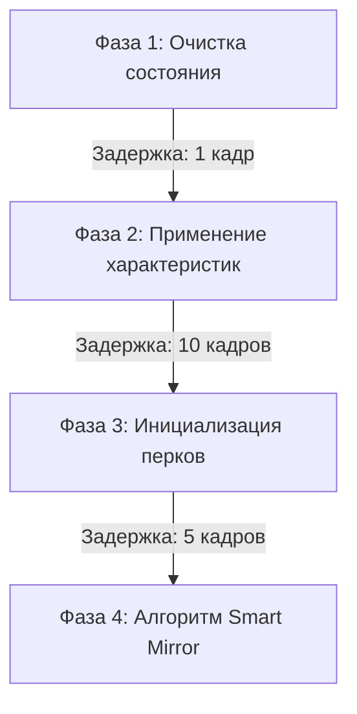

# Builds-EX 

**Система управления конфигурациями персонажа для Cyberpunk 2077**

*Комплексное решение для сохранения и переключения билдов, характеристик, имплантов и экипировки в один клик. Разработано для патча 2.1+*

---

## 📸 Интерфейс

*Главное окно с предпросмотром конфигурации и панелью тонкой настройки*

*Интегрированная панель управления ресурсами*

---

## ⚡ Функциональные возможности

- **Абсолютное сохранение состояния:** Модификация регистрирует полный слепок персонажа, включая характеристики, перки (в том числе ветку биочипа Релик), активные навыки, предметы одежды, киберимпланты, модификации оружия и транспортные средства.
- **Интеллектуальная экипировка (Smart Mirror):** При загрузке конфигурации алгоритм не производит полного снятия предметов. Осуществляется дифференциальная проверка слотов: заменяются только те элементы, которые отличаются от сохраненных данных, что минимизирует нагрузку на движок игры.
- **Фазированная инициализация (Phased Loading):** Внедрена защита от критических сбоев. Процесс применения массивных конфигураций (до 30 предметов и 150 перков одновременно) разделен на 4 асинхронных этапа.
- **Точная репликация вооружения (Weapon Cloner):** Реализовано полное копирование модификаций оружия, включая прицелы, глушители и уровень качества предмета.
- **Режим генерации (Sandbox Mode):** В случае отсутствия необходимых предметов экипировки в инвентаре, система способна автоматически сгенерировать недостающие элементы на основе сохраненных идентификаторов.

---

## 🛠️ Установка и использование

### Системные требования
- **Cyberpunk 2077** (версия 2.1 или выше)
- **[Cyber Engine Tweaks (CET)](https://www.nexusmods.com/cyberpunk2077/mods/107)** (версия 1.28+)

### Руководство по установке
1. Скачать архив с модификацией.
2. Извлечь папку `Builds-EX` из архива в следующую директорию:
   `Cyberpunk 2077\bin\x64\plugins\cyber_engine_tweaks\mods\`
3. Запустить игру. Интерфейс управления вызывается через оверлей CET (кнопка `Builds-EX`).

> [!WARNING]
> Настоятельно рекомендуется создавать резервные копии сохранений игры перед применением глобальных изменений конфигурации.

---

## ⚙️ Архитектура и программная реализация

Данный проект функционирует поверх API Cyber Engine Tweaks, предоставляя оптимизированный движок управления состояниями (State Management). Ниже описаны ключевые технические решения.

### 1. Асинхронная стейт-машина (Phased Loading)
Для предотвращения блокировки основного потока (main thread) при единовременной обработке большого массива данных, инициализация билда разбита на 4 такта:

- Инициализация перков (Фаза 3) выполняется **циклично (до 15 итераций)**. Это необходимо для корректного разрешения зависимостей древа навыков внутренним движком игры (перки высшего уровня требуют предварительной регистрации базовых).

### 2. Дифференциальный анализ слотов
Традиционный метод `UnequipAll()` исключен из логики работы для оптимизации. Вместо него алгоритм `equipment.lua` поочередно проверяет более 80 возможных слотов и подслотов, сравнивая текущие `ItemID` с целевыми, и выполняет точечную замену (`EquipItemInSlot`).

### 3. Рекурсивное копирование (Weapon Cloner)
Поскольку базовый API не поддерживает прямое дублирование модифицированного оружия, модуль `weapon_cloner.lua` программно считывает качество исходного оружия через `StatsSystem:GetStatValue()` и осуществляет сборку нового экземпляра, рекурсивно устанавливая обвесы в подслоты (`Scope`, `PowerModule`, `WeaponMod`).

### 4. Инъекция данных (Патч 2.0+)
- **Сброс характеристик:** Игровой движок лимитирует возможность сброса атрибутов. Ограничение аппаратно обходится посредством инъекции параметра `devData.hasResetAttributes = false` в систему развития (Development System).
- **Валидация очков:** При сбросе характеристик возможна системная потеря свободных очков перков. Система фиксирует значение `GetTrueTotalPoints()` до инициализации сброса и программно возвращает дельту недостающих очков.

---

  <i>Builds-EX — Open Source проект для Cyberpunk 2077</i>

