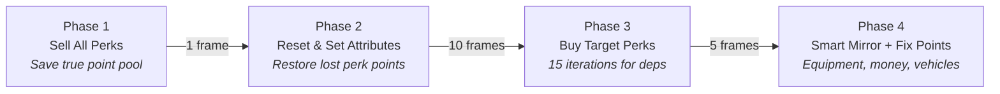

<div align="center">

# ⚡ Builds-EX

### Complete Character Configuration Manager for Cyberpunk 2077

[](#)
[](#)
[](#)
[](#)

**Save. Switch. Dominate.** Full character snapshots — attributes, perks, cyberware, weapons, clothes, vehicles — restored in seconds.

---

[Features](#-features) · [Screenshots](#-screenshots) · [Installation](#-installation) · [Usage](#-usage) · [Architecture](#-architecture) · [FAQ](#-faq)

</div>

---

## 📸 Screenshots

<div align="center">


<br><br>


</div>

---

## ✨ Features

### Core
| Feature | Description |
|---|---|
| **Full State Snapshot** | Captures attributes, perks (including Relic tree), skills, clothing, cyberware (all 10 slots), weapons with attachments, eddies, level, street cred, and unlocked vehicles |
| **One-Click Restore** | Applies a saved configuration through a 4-phase asynchronous pipeline, preventing freezes and crashes |
| **Build Preview** | Displays localized item names, perk counts by branch, attribute totals, and garage contents before loading |

### Smart Systems
| System | How it works |
|---|---|
| **Smart Mirror** | Differential slot comparison — only changed equipment is swapped. Untouched slots remain intact |
| **Weapon Cloner** | Recreates weapon quality and attachments (scopes, muzzles, mods) via `StatsSystem` and `ItemModificationSystem` |
| **AutoSave Carousel** | Maintains a rotating history of 3 automatic backups before each build load |
| **Rental Cache** | Tracks items spawned during Fitting Room mode and destroys them on the next build switch |

### Three Loading Modes

| Mode | Description |
|---|---|
| 🟢 **Legit** | Uses only existing points and inventory. Mathematically scales the build to the current level (proportional distribution if points are insufficient). |
| 🟡 **Sandbox** | Generates missing points and items. Permanent changes to the save file. |
| 🔵 **Fitting Room** | Spawns items temporarily. AutoSaves are frozen. Generated items are destroyed on the next build switch. |

### Cheat Panel
Built-in resource management with fine-grained control:
- **Attribute / Perk points** — add or remove freely
- **Eddies** — inject or drain currency (step: 1 000 / 10 000)
- **Level / Street Cred** — adjust within game limits (1–60 / 1–50)
- **Full Reset** — one-button wipe of all attributes and perks with point refund

---

## 🛠️ Installation

### Requirements
| Dependency | Version | Link |
|---|---|---|
| Cyberpunk 2077 | ≥ 2.1 | — |
| Cyber Engine Tweaks | ≥ 1.28 | [Nexus Mods](https://www.nexusmods.com/cyberpunk2077/mods/107) |

### Steps
1. Download the latest release from the [Releases](../../releases) page
2. Extract the archive into the game root directory:
   ```
   Cyberpunk 2077/
   └── bin/x64/plugins/cyber_engine_tweaks/mods/
       └── Builds-EX/          ← this folder
           ├── init.lua
           ├── core/
           ├── modules/
           └── builds/
   ```
3. Launch the game → press the CET overlay key (default: **`~`**) → click **Builds-EX**

> [!WARNING]
> Always back up save files before applying drastic build changes.

---

## 🎮 Usage

<details>
<summary><b>Saving a build</b></summary>

1. Open the CET overlay
2. Enter a name in the **Build name** field
3. Click **Save current build**
4. A full snapshot of the character state is written to `builds/<name>.json`

</details>

<details>
<summary><b>Loading a build</b></summary>

1. Select a build from the list on the left
2. Review the preview panel (attributes, perks, equipment, vehicles)
3. Adjust load options if needed (toggle attributes, perks, equipment, etc.)
4. Select a loading mode (Legit / Sandbox / Fitting Room)
5. Click **Load build**
6. A progress bar shows the current phase

</details>

<details>
<summary><b>Using History & AutoSaves</b></summary>

- The **History** tab stores automatic backups and manual quick-saves
- Before each build load, the current state is saved as `_AutoSave_1` (previous auto-saves shift to `_2` and `_3`)
- Quick-save manually via the history tab with an optional note

</details>

<details>
<summary><b>Fitting Room workflow</b></summary>

1. Switch to **Fitting Room** mode
2. Load any build — missing items are spawned temporarily
3. Test the build in-game
4. Load another build or switch back — all rental items are automatically destroyed
5. AutoSave carousel is frozen during this mode to protect the original save

</details>

---

## ⚙️ Architecture

### Project Structure
```
Builds-EX/
├── init.lua                    # Entry point, UI (ImGui), state machine
├── core/
│   └── storage.lua             # JSON persistence, filename sanitization, index management
├── modules/
│   ├── attributes.lua          # Read/write 5 core stats, proportional scaling, point fixing
│   ├── perks.lua               # Perk tree traversal, sell/buy with dependency resolution
│   ├── skills.lua              # 5 skill proficiencies (Headhunter, Netrunner, etc.)
│   ├── equipment.lua           # 80+ slot Smart Mirror, Unequip/Equip pipeline
│   ├── weapon_cloner.lua       # Quality injection, recursive attachment cloning
│   ├── builds.lua              # Legacy build I/O (kept for compatibility)
│   ├── ui_native.lua           # Native inkWidget UI injection into game menus
│   └── telemetry.lua           # Session logging to cbm_telemetry.log
└── builds/                     # User save files (*.json)
```

### Phased Loading Pipeline

The build loading process is split into 4 asynchronous phases executed across multiple frames to avoid blocking the main thread:



### Key Technical Decisions

<details>
<summary><b>Why 15 perk purchase iterations?</b></summary>

The game engine enforces a dependency tree for perks — higher-tier perks require lower-tier prerequisites. Since `BuyNewPerk()` silently fails if prerequisites are unmet, the purchase loop runs 15 times. Each iteration unlocks more prerequisites, allowing deeper perks to be purchased in subsequent passes.

</details>

<details>
<summary><b>Why inject <code>hasResetAttributes = false</code>?</b></summary>

Patch 2.0 introduced a hard limit: attributes can only be reset once per playthrough via the in-game menu. The mod bypasses this by directly setting `devData.hasResetAttributes = false` on the `PlayerDevelopmentData` object before calling `ResetAttributes()`. This enables unlimited resets during build switching.

</details>

<details>
<summary><b>How does the Smart Mirror avoid full unequip?</b></summary>

Instead of `UnequipAll()` → `EquipAll()`, the algorithm iterates over all equipment areas and 4 sub-slots each (80+ checks). For each slot, it compares the current `ItemID.tdbid` hash against the target. Three outcomes:
- **Match** → skip (no action)
- **Target empty** → unequip via `UnequipRequest` or fallback to `PlayerData:UnequipItem()`
- **Different item** → search backpack → spawn if missing (Sandbox/Fitting Room) → equip via `EquipRequest` with `PlayerData:EquipItem()` fallback for cyberware

</details>

<details>
<summary><b>How does Weapon Cloner work?</b></summary>

1. On save: `ExtractWeaponData()` reads the weapon's quality via `StatsSystem:GetStatValue()` and iterates `GetItemParts()` to capture all attachments (Scope, PowerModule, WeaponMod)
2. On load: `CloneAndInstallParts()` spawns the base weapon, injects quality via `gameConstantStatModifierData`, then spawns each attachment and installs it via `ItemModificationSystem:InstallItemPart()`
3. Attachment quality is matched to the base weapon's quality level for consistency

</details>

<details>
<summary><b>Why does point restoration exist?</b></summary>

When `ResetAttributes()` is called, the engine may silently consume perk points without returning them. The mod captures the true total (free + spent) via `GetTrueTotalPoints()` before the reset, then calculates the delta after reset and injects the missing points back via `AddDevelopmentPoints()`.

</details>

---

## ❓ FAQ

<details>
<summary><b>Is this safe for my save file?</b></summary>

In **Legit** mode — fully safe. Only existing resources are used. In **Sandbox** mode — items and points are permanently added. In **Fitting Room** mode — temporary items are tracked and removed automatically, but it's always wise to keep backups.

</details>

<details>
<summary><b>Does this work with other mods?</b></summary>

Builds-EX operates through CET's Lua API and does not modify game archives. It is compatible with most mods. Potential conflicts may arise with other mods that also manipulate `EquipmentSystem` or `PlayerDevelopmentSystem` simultaneously.

</details>

<details>
<summary><b>Can the UI language be changed?</b></summary>

Full bilingual support (English and Russian) is built right in. You can toggle between languages at any time using the button in the top right corner of the mod.

</details>

---

<div align="center">

**Builds-EX** is an open-source project released under the [MIT License](LICENSE)

Contributions, issues, and feature requests are welcome

</div>
