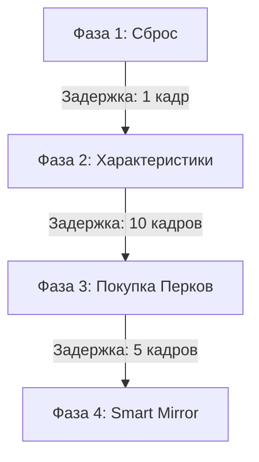

# Builds-EX 

**Менеджер Конфигураций для Cyberpunk 2077**

*Сохраняйте и переключайте ваши билды, одежду, киберимпланты и способности в один клик. Разработано для патча 2.1+*

---

## 📸 Интерфейс

  
  
<i>Главный интерфейс с предпросмотром билда и панелью тонкой настройки</i>

   
  
  
<i>Встроенная Чит-Панель для быстрой выдачи ресурсов</i>

---

## ⚡ Ключевые возможности

- **Сохранение всего персонажа:** Запоминает характеристики, перки (включая ветку биочипа Релик), навыки, одежду, киберимпланты, оружие и даже автомобили.
- **Smart Mirror (Умная загрузка):** При загрузке билда алгоритм не снимает все вещи без разбору. Он проверяет слоты и меняет только то, что отличается от сохраненного билда, экономя ресурсы игры.
- **Phased Loading (Фазированная загрузка):** Защита от вылетов. Чтобы игра не зависла при одновременной экипировке 30 предметов и прокачке 150 перков, процесс разбит на 4 этапа.
- **Weapon Cloner (Клонирование оружия):** Точное копирование качества и всех модификаций (прицелы, глушители) вашего оружия.
- **Sandbox Mode (Песочница):** Не хватает легендарного импланта для билда? Включите этот режим, и мод сгенерирует недостающие предметы из воздуха.

---

## 🛠️ Установка

### Требования
- **Cyberpunk 2077** (версия 2.1 или выше)
- **[Cyber Engine Tweaks (CET)](https://www.nexusmods.com/cyberpunk2077/mods/107)** (версия 1.28+)

### Инструкция
1. Скачайте архив с модом.
2. Распакуйте папку `Builds-EX` из архива по следующему пути:
   `Cyberpunk 2077\bin\x64\plugins\cyber_engine_tweaks\mods\`
3. Запустите игру. Меню мода можно открыть через окно CET (кнопка `Builds-EX`).

> [!WARNING]
> Рекомендуется делать бэкапы ваших сохранений перед кардинальной сменой билда.

---

## ⚙️ Под капотом (Для мододелов и гиков)

Этот мод не просто переключает массивы. Это полноценный движок управления стейтами, работающий поверх CET API.

### 1. Phased Loading (Стейт-машина загрузки)
Во избежание зависаний и вылетов из-за перегрузки основного потока (main thread) при единовременной обработке множества предметов и перков, процесс инициализации билда разделен на 4 асинхронные фазы:

- В третьей фазе покупка перков происходит **циклично (в 15 итераций)** для корректного разрешения дерева зависимостей игрового движка.

### 2. Smart Mirror (Алгоритм экипировки)
Вместо классического метода `UnequipAll()`, алгоритм поочередно проверяет 80 возможных слотов и подслотов.

### 3. Клонирование оружия (Weapon Cloner)
Базовый API не поддерживает прямое копирование модифицированного оружия. Модуль `weapon_cloner.lua` считывает качество оружия через `StatsSystem:GetStatValue()`, после чего рекурсивно анализирует подслоты (`Scope`, `PowerModule`, `WeaponMod`).

### 4. Обход ограничений Патча 2.0+
- **Блокировка сброса атрибутов:** Движок ограничивает сброс характеристик до одного раза. Ограничение обходится путем инъекции `devData.hasResetAttributes = false`.
- **Восстановление очков перков:** При сбросе характеристик возможна системная потеря очков перков. Мод фиксирует значение `GetTrueTotalPoints()` до сброса и программно возвращает недостающие очки.

---

  <i>Builds-EX — Open Source проект для Cyberpunk 2077</i>

